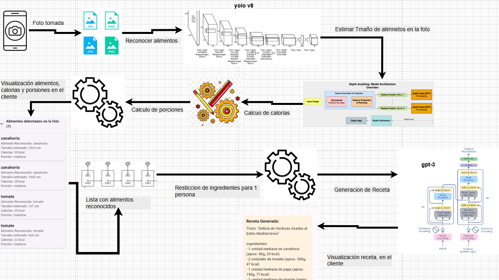
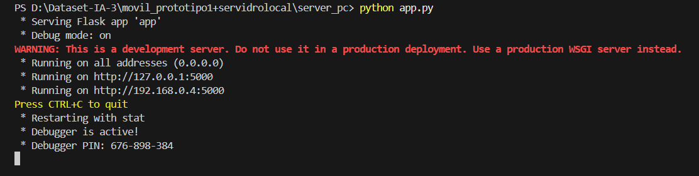
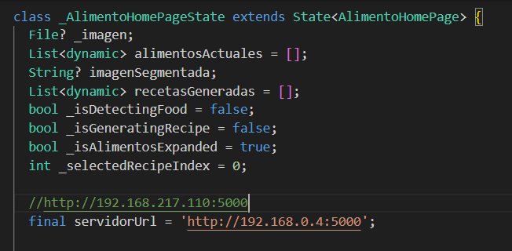
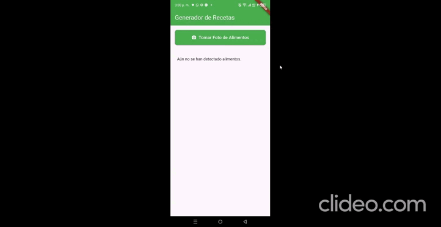

# # 🍽️ Generador Inteligente de Recetas Saludables
## informacion de el Proyecto 
<table>
<tr>
<td><strong>Universidad</strong></td>
<td>San Francisco Xavier de Chuquisaca</td>
</tr>
<tr>
<td><strong>Carrera</strong></td>
<td>Ingeniería en Ciencias de la Computación</td>
</tr>
<tr>
<td><strong>Materia</strong></td>
<td>Desarrollo de Aplicaciones Inteligentes - IA3</td>
</tr>
<tr>
<td><strong>Autor</strong></td>
<td><strong>Alfaro Ayzama José Fernando</strong></td>
</tr>
<tr>
<td><strong>👨‍🏫 Docente</strong></td>
<td>Ing. Carlos Walter Pacheco Lora</td>
</tr>
<tr>
<td><strong>Curso</strong></td>
<td>2025 - 7mo Semestre</td>
</tr>
</table>

## 📌 Descripción Breve

> 📷imagen tomada ➜ 🧠procesada ➜ 📝lista de ingredientes➜📝porsion para una persona➜🥗 Receta saludable + 🍳 Receta tradicional

Con solo tomar una foto,la appidentifica los alimentos, calcula las porciones y calorías, y te sugiere 2 tipos de recetas personalizadas en cuestión de segundos. Ideal para usuarios preocupados por su nutrición, estudiantes, y aplicaciones educativas o médicas.

---

## ⚙️ ¿Cómo Funciona?

1. **Captura de Imagen**: El usuario toma una fotografía desde la app móvil (Flutter).
2. **Reconocimiento de Alimentos**: El servidor usa el modelo YOLOv8n para identificar y segmentar los alimentos.
3. **Estimación de Volumen y Calorías**: Se utiliza Depth Anything para estimar volumen y convertirlo en calorías usando tablas nutricionales.
4. **Generación de Recetas**: GPT-3 (OpenAI) genera dos recetas por imagen: una saludable y una tradicional.
5. **Visualización en App**: Todo se muestra al usuario en la aplicación móvil.

es un software basado en inteligencia artificial que reconoce alimentos mediante imágenes capturadas por un dispositivo móvil, estima su volumen y contenido calórico, y genera automáticamente dos tipos de recetas: una saludable y una tradicional. Este proyecto combina visión por computadora, estimación volumétrica y procesamiento de lenguaje natural para ofrecer una herramienta innovadora en el ámbito de la nutrición personalizada.

<p>
  
</p>

## 🧠 Tecnologías y Modelos Utilizados

- **YOLOv8n-seg** – Detección y segmentación de alimentos.
- **Depth Anything** – Estimación monocular de profundidad para cálculo de volumen.
- **GPT-3 (OpenAI)** – Generación automática de recetas personalizadas.
- **Flutter** – Desarrollo de la aplicación móvil.
- **Flask** – Backend para procesamiento de imágenes e inferencias.

## ⚙️ Funcionalidades

- Captura de imagen desde la app móvil.
- Identificación de alimentos en tiempo real.
- Estimación de volumen y calorías por ingrediente.
- Generación de dos recetas: saludable y tradicional.
- Visualización inmediata de resultados en la app.

## 🧠 Entrenamiento y Calibración (Google Colab)
- El modelo YOLOv8n fue entrenado en **Google Colab** usando Roboflow para procesamiento y dataset (36,000 imágenes / 15 clases).
- Se utilizó `Ultralytics` para entrenamiento, alcanzando un 86 % de precisión.
- Se guardó el modelo como `yolov8n.pt` para ser usado en el backend Flask.

## 📏 Calibración con Depth Anything

- También en Colab, se usó Depth Anything sobre las imágenes procesadas por YOLO para estimar el volumen de cada alimento segmentado.
- A partir de la estimación de profundidad monocular, se calcularon porciones y calorías usando tablas nutricionales estáticas.

Ambos notebooks estarán disponibles en la carpeta `/docs/`.
## 📁  Estructura de Carpetas 
```plaintext
📁 SmartRecipeAI/
├── backend/               # Servidor Flask
│   ├── app.py             # Código principal del servidor
│   ├── yolov8n.pt         # Modelo entrenado YOLOv8
│   ├── .env               # Claves de entorno
│   ├── requirements.txt   # Librerías necesarias
│   └── ...
├── mobile_app/            # Aplicación Flutter
│   ├── lib/
│   ├── android/
│   └── pubspec.yaml
├── docs/                  # Notebooks en Colab
│   ├── entrenamiento_yolo.ipynb
│   └── calibracion_depth.ipynb
└── README.md              # Este archivo
```
## 🌐 Backend: Requisitos y Ejecución

La carpeta `backend/` contiene el servidor Flask (`app.py`) y el modelo `yolov8n.pt`.

### 📦 Requisitos
flask==2.3.3
python-dotenv==1.0.1
torch>=2.0.0
torchvision>=0.15.0
ultralytics==8.0.176
opencv-python==4.9.0.80
numpy==1.26.4
Pillow==10.2.0
transformers==4.41.1
diffusers==0.27.2
scikit-image==0.22.0
tqdm==4.66.4
requests==2.31.0
matplotlib==3.8.4
scipy==1.13.1
openai==1.30.1
### 📦 Instalaciones y ejecucion 
🧰 Comandos de instalación por librería
🟦 Flask (servidor web)
```bash
pip install flask==2.3.3
pip install python-dotenv==1.0.1
pip install ultralytics==8.0.176
pip install opencv-python==4.9.0.80
pip install Pillow==10.2.0
pip install transformers==4.41.1
pip install diffusers==0.27.2
pip install requests==2.31.0
pip install scipy==1.13.1
pip install openai==1.30.1
```
Posteriormente instala un entorno virtual en la caperta donde quieras ejecutar el Servidor
```bash
python -m venv venv
```
reuerda generar tu api key en https://platform.openai.com/docs/overview
crea un archivo .env donde se guardo la carpeta de el servidor y copia tu api key generada
ejecuta el servidor 
```bash
python app.py
```
copia la ip generada para que el cliente se pueda conectar 
<p>
  
</p>

## 📱 Aplicación Móvil: Requisitos y Ejecución
La carpeta aplicaionmovil/ contiene la app Flutter que interactúa con el servidor Flask.

## 📦 Requisitos
-Flutter SDK instalado (https://docs.flutter.dev/get-started/install)
-Android Studio o dispositivo Android
-Conexión al servidor Flask local
### 📦 Instalaciones y ejecucion 

Recuerda verificar si tienes todo instalado ejecutando esto en la carpeta
```bash
flutter doctor
```
 posteriormente ejecutar
```bash
flutter pub get
```
recuerda tener o cambiar el la ip de el servidor
<p>
  
</p>

ejecuta para correr la aplicación

```bash
flutter run
```

## Demostracion
<p>
  
</p>
